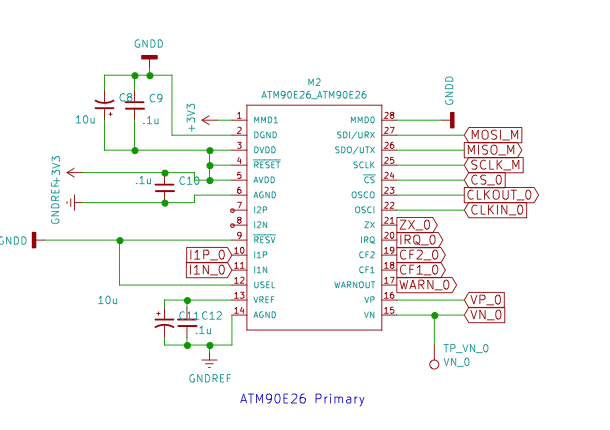
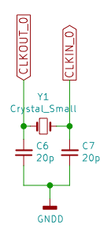
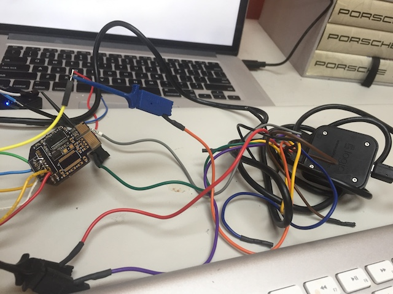

Kicad is used to create the schematic and layout.
# Meter PCB
The meter PCB takes in the voltage and current readings from the Power PCB and uses two atm90e26 energy monitor ICs to convert the readings to DC readings.  The DC readings are sent to the microcontroller over SPI. The Meter PCB is one of the three PCBs that make up the FitHome hardware.  The other two are the:  
* [The Power PCB](https://github.com/BitKnitting/FitHome_Power_PCB)  monitors the incoming voltage and current of a (North American's) home energy lines.  
* [The microcontroller PCB](https://github.com/BitKnitting/Tisham_PCB_Feather).  The microcontroller PCB mounts a microcontroller with wifi - like a Feather RFM95 or a wemos D1 (a bit up in the air as of this date - 4/5/2019).  The microcontroller gets the voltage and current readings from the atm90e26's over SPI and then sends them via mqtt.
# Thanks to Those That Went Before
This project extends [Tisham Dhar's work on building energy monitors using an atm90e26](https://github.com/whatnick/DIN_Rail_EnergyMonitor).  In particular, [the DIN Rail energy monitor](https://www.crowdsupply.com/whatnick/atm90e26-energy-monitor-kits).  Besides his open source projects, Tisham has been exceptionally helpful and supportive.  Tisham continues to inspire me.  THANK YOU.

Before I took [Chris Gammell's Contextual Electronics course](https://contextualelectronics.com/), I had absolutely no experience with electronics or building PCBs.  Chris is exceptional in so many ways.  THANK YOU.

There is an exceptional community behind [the OpenEnergyMonitor project](https://learn.openenergymonitor.org/).  They not only provide energy monitoring solutions, but are a wealth of knowledge.  THANK YOU.
# The Schematic
## atm90e26
The two atm90e26's are the protagonists of the schematic.  

The voltage readings (VP_0 and VP_1) read by [the Power PCB](https://github.com/BitKnitting/FitHome_Power_PCB) are inputs to pins 16 and 15.  Similarly, the current readings (I1P_0 and I1P_1) are inputs to pins 10 and 11.  Recall that power comes into a house in North America through [two power lines](https://en.wikipedia.org/wiki/Split-phase_electric_power).  This is why there are two atm90e26's.

The atm90e26 is flexible in its Metering Mode configuration. The datasheet notes:

```
MMD1/0: Metering Mode Configuration
00: anti-tampering mode (larger power);
01: L line mode (fixed L line);
10: L+N mode (applicable for single-phase three-wire system);
11: flexible mode (line specified by the LNSel bit (MMode, 2BH))
```
We're only intested in L line mode (01). This is why pin 20 (MMD0) is set to GND and pin 1 (MMD1) is set to 3.3V.
## The Oscillator
As you probably know better than me, an oscillator is needed to generate clock signals to control the speed of the atm90e26's processor.  The datasheet notes using a crystal oscillator with a frequency of 8.192 MHz.  

### Why 20pF Caps
The datasheet states: _An 8.192 MHz crystal is connected between OSCI and OSCO. In application,
this pin should be connected to ground through a 12pF capacitor._  So why a 20pF cap if the datasheet states a 12p cap should be used.

I am following the advice of Tisham: _The BOM for the DIN rail uses a different crystal and hence different load capacitance (20pF)...Crystals are affected by board parasitics as well. Please see [the Adafruit article](https://blog.adafruit.com/2012/01/24/choosing-the-right-crystal-and-caps-for-your-design/) about this. The values I picked are only via rule of thumb. Try and see._  

The crystal being used is [PN AA-8.192MAGE-T](http://www.txccrystal.com/images/pdf/aa-automotive.pdf).  The datasheet states the Load Capacitance (CL) to be 8pF.  

Going on the advice in the Adafruit article, a "best estimate" for the capacitors (C1 and C2) is C1, C2 = 2*CL – 2*Cstray  where Cstray is described as: _Unfortunately, every trace, every lead on your component, just about everything on your PCB has some stray capacitance.  The total of these values is represented by Cstray.  You can usually guestimate this in the neighbourhood of 2-5pF as long as you follow good layout practice and keep the trace from the crystal to the pins on the MCU as short as possible with no vias, etc._

If we use Cstray = 3pF, 2*8 - 2*3 = 12pF - which is what is recommended in the datasheet. As of 4/10/2019 I am using 20pF based on Tisham's testing/recommendation.  If 20 doesn't work, I'll try 12pF and move up from there.  Challenges bring opportunities.

### My Frankenstein Test
I soldered an atm90e26 and the corresponding caps and resistors to get SPI working from the first meter PCB to an itsy bitsy.  I used Circuit Python and my Happyday_M90E26_SPI.py library to send SPI commands to the meter within the Mu editor.



#### Results
Sending request to read the System Status:
```
MOSI: 0x81;  MISO: 0xFF	
```
Value returned my atm90e26:  
```
MOSI: 0x00;  MISO: 0x00	
MOSI: 0x00;  MISO: 0x02	
```
OOH!  Isn't that GREAT?  System status = 2.  It is what I expected based on results I have gotten in the past.

Sending request to read the meter status:  
```
MOSI: 0xC6;  MISO: 0xFF	
```
Value returned: 
```
MOSI: 0x00;  MISO: 0xC8	
MOSI: 0x00;  MISO: 0x02	
```
Meter status = 0xC802.  I expected 0xC801.  

__TODO:__  
The Meter Status (46H) register notes that bits 1 - 0 when fixed L line (which I thought I had  i.e.: MMD1 = 0, MMD0 = 1) should be 01.  But the reading of 2 indicates MMD1 = 1 and MMD0 = 0.  Which is L+N mode.  __AHA!  I have this backword on the schematic.  So the meter status reading is correct given the current meter setting.  Currently, MMD1 is connected to +3.3V and MMD0 is connected to GND.__  
  
_ARGH.  The datasheet in the pin description led me to believe the MMD0 and 1 settings were reverse.  Then the description of the 46H register has it the reverse!  Well isn't that special!_
# Connectors
There are two connectors:  
* The male end of the PCI-E.  This is just a footprint on the PCB.  
* The PCB - PCB right angle 10 pin connector that connects the meter PCB to the uPCB.
## PCB - PCB connector
The one used is: 
* [52418-1010](https://www.mouser.com/datasheet/2/276/0524181010_PCB_RECEPTACLES-170490.pdf) molex Female side of connector.  These are around $1.22 each at [Digikey](https://www.digikey.com/product-detail/en/molex/52418-1010/WM6478-ND/481106) and $1.04 each at [Mouser](https://www.mouser.com/ProductDetail/538-52418-1010).  The Female is soldered onto the meter PCB.
* [53290-1080](https://www.molex.com/pdm_docs/sd/532901080_sd.pdf) male is $.82/each at [Digikey](https://www.digikey.com/product-detail/en/molex/53290-1080/WM24313-ND/917592) and $.90 each at[Mouser](https://www.mouser.com/ProductDetail/Molex/53290-1080?qs=%2Fha2pyFaduiHJk6fZnMcvUZuJ6ieM0yPA3e7l1ZVdEg%3D). The Male is soldered onto the uPCB.


